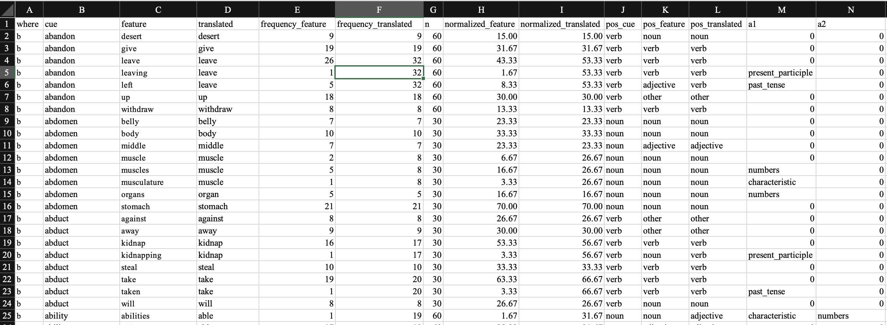

```{r load_packages, include = FALSE}
library("papaja")
library(MOTE)
library(shiny) #to cite shiny
library(MBESS)
library(plyr)
library(expss)
```

Semantic features are the focus of a large area of research which tries to delineate the semantic representation of a concept. These features are key to models of semantic memory [i.e., memory for facts; @Collins1969; @Collins1975], and they have been used to create both feature based [@Smith1974; @Cree2003; @Vigliocco2004] and distributional based models [@Jones2007; @Griffiths2007; @Riordan2011]. Semantic representation is built in a distributional model by examining the co-occurrence of words in a large text with the idea that similar contexts for concepts indicate similarity in meaning. Feature based models simply indicate that similarity between concepts is defined by their overlapping features. To create feature based similarity, participants were often asked to create lists of properties for categories of words. This property listing was a seminal task with corresponding norms that have been prevalent in the literature [@Toglia1978; @Toglia2009; @Rosch1975; @Ashcraft1978a]. Feature production norms are created by soliciting participants to list properties or features of a target concept without focusing on category. These features are then compiled into feature sets that are thought to represent the memory representation of a particular concept [@Collins1969; @Collins1975; @Jones2015a; @McRae2013]. 

For example, when queried on what features define a *cat*, participants may list *tail*, *animal*, and *pet*. These features capture the most common types of descriptions: "is a" and "has a". Additionally, feature descriptions may include uses, locations, behavior, and gender (i.e., *actor* denotes both a person and gender). The goal of these norms is often to create a set of high-probability features, as there can and will be many idiosyncratic features listed in this task, to explore the nature of concept structure. In the classic view of category structure, concepts have defining features or properties, while the probabilistic view suggests that categories are fuzzy with features that are typical of a concept [@Medin1989]. These norms have now been published in Italian [@Montefinese2013; @Reverberi2004], German [and Italian, @Kremer2011a], Portuguese [@Stein2009], Spanish [@Vivas2017], and Dutch [@Ruts2004], as well as for the blind [@Lenci2013].

Previous work on semantic feature production norms in English includes databases by @McRae2005, @Vinson2008, @Buchanan2013, and @Devereux2014. @McRae2005's feature production norms focused on 541 nouns, specifically living and nonliving objects. @Vinson2008 expanded the stimuli set by contributing norms for 456 concepts that included both nouns and verbs. @Buchanan2013 broadened to concepts other than nouns and verbs with 1808 concepts normed. The @Devereux2014 norms included a replication of @McRae2005's concepts with the addition of several hundred more concrete concepts. The current paper represents nearly two thousand new concepts added to these previous projects and a reanalysis of the original data.   

Creation of norms is vital to provide investigators with concepts that can be used in future research. The concepts presented in the feature production norming task are usually called *cues*, and the responses to the cue are called *features*. The concept paired with a cue (first word) is denoted as a *target* (second word) in semantic priming tasks. In a lexical decision task, participants are shown cue words before a related or unrelated target word. Their task is to decide if the target word is a word or nonword as quickly as possible. A similar task, naming, involves reading the target word aloud after viewing a related or unrelated cue word. Semantic priming occurs when the target word is recognized (responded to or read aloud) faster after the related cue word in comparison to the unrelated cue word [@Moss1995]. The feature list data created from the production task can be used to determine the strength of the relation between cue and target word, often by calculating the feature overlap, or number of shared features between concepts [@McRae2005]. Both the cue-feature lists and the cue-cue combinations (i.e., the relation between two cues in a feature production dataset, which becomes a cue-target combination in the priming task) are useful and important data for researchers in exploring various semantic based phenomena.

These feature lists can provide insight into the probabilistic nature of language and conceptual structure. Some features are considered more typical (e.g., probable) and are listed more often than others. Further, processing  time is speeded for concepts with more listed features, which is referred to as the number of features effect [@Moss2002; @Cree2003; @McRae1997; @Pexman2003]. The feature production norms can be used as the underlying conceptual data to create models of semantic priming and cognition focusing on cue-target relation [@Cree1999; @Rogers2004; @Vigliocco2004]. By selecting stimuli from these norms, others have studied semantic word-picture interference [i.e., slower naming times when distractor words are related category concepts in a picture naming task; @Vieth2014], recognition memory [@Montefinese2015], meaning-syntactic differences [i.e., differences in naming times based on semantic or syntactic similarity; @Vigliocco2002; @Vigliocco2005], and semantic richness, which is a measure of shared defining features [@Grondin2009; @Kounios2009; @Yap2015; @Yap2016]. Last, neuropsychological research has benefited from feature production norms, as @Vinson2002 and @Vinson2003 have used these norms to explore aphasia (i.e., the loss of understanding speech).

However, it would be unwise to consider these norms as an exact representation of a concept in memory [@McRae2005]. These norms represent salient features that participants can recall, likely because saliency is considered special to our understanding of concepts [@Cree2003]. Additionally, @Barsalou2003 suggested that participants are likely creating a mental model of the concept based on experience and using that model to create a feature property list. This model may represent a specific instance of a category (i.e., their pet dog), and feature lists will represent that particular memory. One potential solution to overcome saliency effects would be to solicit applicability ratings for features across multiple exemplars of a category, as @DeDeyne2008 have shown that this procedure provides reliable ratings across exemplars and provides more connections than the sparse representations that can occur when producing features. 

Computational modeling of memory requires sufficiently large datasets to accurately portray semantic memory, therefore, the advantage of big data in psycholinguistics cannot be understated. There are many large corpora that could be used for exploring the structure of language and memory through frequency [see the SUBTLEX projects @Brysbaert2009; @New2007]. Additionally, there are large lexicon projects that explore how the basic features of words affect semantic priming, such as orthographic neighborhood (words that are one letter different from the cue), length, and part of speech [@Balota2007; @Keuleers2012]. In contrast to these basic linguistic features of words, other norming efforts have involved subjective ratings of concepts. Large databases of age of acquisition [i.e., rated age of learning the concept; @Kuperman2012], concreteness [i.e., rating of how perceptible a concept is; @Brysbaert2013], and valence [i.e., rating of emotion in a concept; @Warriner2013] provide further avenues for understanding the impact these rated properties have on semantic memory. For example, age of acquisition and concreteness ratings have been shown to predict performance on recall tasks [@Dewhurst1998; @Brysbaert2013], while valence ratings are useful for gauging the effects of emotion on meaning [@Warriner2013]. These projects represent a small subset of the larger normed stimuli available [@Buchanan2018], however, research is still limited by the overlap between these datasets. If a researcher wishes to control for lexical characteristics and subjective rating variables, the inclusion of each new variable to the study will further restrict the item pool for study. Large, overlapping datasets are crucial for exploring the entire range of an effect ensuring that the stimuli set is not the only contributing factor to the results of a study. 

Therefore, the purpose of this study was to expand the number of cue and feature word stimuli available, which additionally increases the possible cue-target pairings for studies using word-pair stimuli (like semantic priming tasks). To accomplish these goals, we have expanded our original semantic feature production norms [@Buchanan2013] to include all cues and targets from The Semantic Priming Project [@Hutchison2013]. The existing norms were reprocessed along with these new norms to provide new feature coding and affixes (i.e., word addition that modifies meaning, such as *pre* or *ing*) to explore the impact of word form. Previously, @Buchanan2013 illustrated convergent validity with @McRae2005 and @Vinson2008 even with a different approach to processing feature production data. In @McRae2005 and @Vinson2008, features were coded with complexity, matching the "is a" and "has a" format that was first found in @Collins1969 and @Collins1975. @Buchanan2013 took a count based approach, wherein each feature is treated as a separate concept (i.e., *four legs* would be treated as two features, rather than one complex feature). Both approaches allow for the computation of similarity by comparing feature lists for cue words, however, the count based approach matches popular computational models, such as Latent Semantic Analysis [@Landauer1997] and Hyperspace Analogue to Language [@Lund1996]. These models treat each word in a document or text as a cue word and similarity is computed by assessing a matrix of frequency counts between concepts and texts, which is similar to comparing overlapping feature lists. 

In contrast, hybrid models include both a compositional view [i.e., words are first broken down into their components *cat* and *s*; @Jarvella1983; @MacKay1978] and a full-listing view [i.e., each word form is represented completely separately, *cat* and *cats* @Bradley1980; @Butterworth1983], and processing occurs as a race between each type of representation. Given these various models, we created a coding system to capture the feature word meaning, in addition to morphology, to provide different levels of information about each cue-feature combination. In the previous study by @Buchanan2013, each feature was converted to a common form if they denoted the same concept (i.e., most features were translated to their root form). To reduce the sparsity of the matrix, features such as *beauty* or *beautiful* are grouped together to help capture the essential features. However, we previously included a few exceptions to this coding system, such as *act* and *actor* when the differences in features denoted a change of action (noun/verb) or gender or cue sets did not overlap (i.e., features like *will* and *willing* did not have overlapping associated cues). These exceptions were designed to capture how changes in morphology might be important cues to word meaning, as hybrid models of word identification have outlined that morpheme processing can be complex [@Caramazza1988; @Marslen-Wilson1994]. In this study, we reduced words to their root form, but additionally coded the affixes to ensure a reduction in sparsity and morphological information was included.

The entire dataset is available at http://wordnorms.com/ which allows the use of detailed queries to search for specific stimuli. The data collection, (re)processing, website, and finalized dataset are detailed below. The basic properties of the cue-feature data will be detailed, such as the average number of features each cue elicited across parts of speech and datasets. The cue-feature data will be explored for divergent validity from the free association norms to show evidence that the new feature production norms provide additional information not found in the @Nelson2004 dataset. We then provide details on how to calculate semantic similarity and then use these values to portray convergent validity by correlating multiple measures of meaning. Additionally, the similarity measures are compared to the priming times from the Semantic Priming Project [@Hutchison2013] to demonstrate the relation between semantic similarity and priming. 

# Method

## Participants

A total of 198 new participants were recruited from Amazon's Mechanical Turk, which is a large, diverse participant pool wherein users can complete surveys for small sums of money [@Buhrmester2011]. Participants signed up for the HITS through Amazon's Mechanical Turk website and completed the study within the Mechanical Turk framework. These data were combined with previously collected datasets, for which we list the location of testing, sample size and number of concepts in Table \@ref(tab:part-table). Participant answers were screened for errors, and incorrect or incomplete surveys were rejected or discarded without payment. These surveys were usually rejected if they included copied definitions from Wikipedia, "I don't know", or the participant wrote a paragraph about the concept. Each participant was paid five cents for a survey, and they could complete multiple Human Intelligence Tasks or HITS. Participants were required to be located in the United States with a HIT approval rate of at least 80%, and no other special qualifications were required. HITS would remain active until *n* = 30 valid survey answers were obtained.

```{r part-table, echo=FALSE, results='asis'}
####partcipant table####
participant.table2 = matrix(NA, nrow = 5, ncol = 4)

colnames(participant.table2) = c("Institution", "Total Participants",
                         "Concepts", "Mean $N$")

participant.table2[1, ] = c("University of Mississippi", 749, 658, 67.8)
participant.table2[2, ] = c("Missouri State University", 1420, 720, 71.4)
participant.table2[3, ] = c("Montana State University", 127, 120, 63.5)
participant.table2[4, ] = c("Mechanical Turk 1", 571, 310, 60)
participant.table2[5, ] = c("Mechanical Turk 2", 198, 1914, 30)         

apa_table(as.data.frame(participant.table2),
                align = c(rep("l", 1), rep("c", 3)), 
                caption = "Sample Size and Concept Norming Size for Each Data Collection Location/Time Point",
                col.names = c("Institution", "Total Participants",
                         "Concepts", "Mean $N$"))
```

## Materials

```{r calculate-frequency, include=FALSE}

dat1 = read.csv("final words 2017.csv")
sub1 = subset(dat1,
              dat1$where == "b")

####stimuli table####

#we want the number of features for each concept
#reduce down to just the translated data
sub1.reduce = sub1[ , c("cue", "translated", "pos_cue", "school_code")]
sub1.reduce = unique(sub1.reduce)
sub1.reduce$cue = droplevels(sub1.reduce$cue)

#for each cue calculate the number of features listed
nofeatures = as.data.frame(table(sub1.reduce$cue))
colnames(nofeatures)[1] = "cue"

#add in the school code and pos_cue
finalfreq = unique(merge(nofeatures, sub1.reduce[ , c("cue", "pos_cue", "school_code")], by = "cue"))

#now calculate statistics - means by school
with(finalfreq, tapply(Freq, list(pos_cue, school_code), mean))
with(finalfreq, tapply(Freq, list(pos_cue, school_code), sd))

##mean frequency per school
with(finalfreq, tapply(Freq, list(school_code), mean))
with(finalfreq, tapply(Freq, list(school_code), sd))

##mean frequency by part of speech
with(finalfreq, tapply(Freq, list(pos_cue), mean))
with(finalfreq, tapply(Freq, list(pos_cue), sd))

##total total 
mean(finalfreq$Freq); sd(finalfreq$Freq)

partofspeech = unique(dat1[ , c("cue", "pos_cue")])
POS = apa(table(partofspeech$pos_cue)/nrow(partofspeech)*100,1)

#mturk2 is this dataset
justusPOS = na.omit(unique(dat1[dat1$word_list == "mturk2", c("cue", "pos_cue") ]))
justusPOStable = apa(table(justusPOS$pos_cue)/nrow(justusPOS)*100,1)
```

The 1914 new concepts provided in this study expands upon the 1808 concepts previously published in @Buchanan2013 and provides complete coverage of the Semantic Priming Project [@Hutchison2013]. The concept set from  @Buchanan2013 was selected primarily from the @Nelson2004 database, with small overlaps in the @McRae2005 and @Vinson2008 database sets for convergent validity. To create the final database of 4436 concepts, the @Buchanan2013, @McRae2005, and @Vinson2008 feature lists were all combined into one larger dataset. Concepts were labeled by their most frequent part of speech using the English Lexicon Project [@Balota2007] and Google's define search. The complete dataset of 4436 concepts includes: `r POS[2]`% of concepts were nouns, `r POS[1]`% adjectives, `r POS[4]`% verbs, and `r POS[3]`% were other forms of speech, such as adverbs and conjunctions. The new concepts from this norming set only constituted: `r justusPOStable[2]`% nouns, `r POS[1]`% adjectives, `r POS[4]`% verbs, and `r POS[3]`% other parts of speech. 

## Procedure

The survey instructions were copied from @McRae2005's Appendix B, which were also used in the previous publication of these norms. Because the @McRae2005 data were collected on paper, we modified these instructions slightly. The original lines to write in responses were changed to an online text box response window. The detailed instructions additionally no longer contained information about how a participant should only consider the noun of the target concept, as the words in our study included multiple forms of speech and senses. Participants were encouraged to list the properties or features of each concept in the following areas: physical (looks, sounds, and feels), functional (uses), and categorical (belongings). The exact instructions were as follows:

*We want to know how people read words for meaning. Please fill in features of the word that you can think of. Examples of different types of features would be: how it looks, sounds, smells, feels, or tastes; what it is made of; what it is used for; and where it comes from. Here is an example:*

*duck: is a bird, is an animal, waddles, flies, migrates, lays eggs, quacks, swims, has wings, has a beak, has webbed feet, has feathers, lives in ponds, lives in water, hunted by people, is edible*

*Complete this questionnaire reasonably quickly, but try to list at least a few properties for each word. Thank you very much for completing this questionnaire.*

## Data Processing

The entire dataset, at each processing stage described here, can be found at: https://osf.io/cjyzw/.^[On our OSF page, we have included a detailed processing guide on how concepts were examined for this publication. This paper was written with *R* markdown [@R-base] and *papaja* [@R-papaja]. The markdown document allows an interested reader to view the scripts that created the article in line with the written text. However, the processing of the text documents was performed on the raw files, and therefore, we have included the processing guide for transparency of each stage.] First, each concept's answers were separated into an individual text file that is included as the "raw" data online. Each of these files was then spell checked and corrected if it was clear that the participant answer was a typo. As noted earlier, participants often cut and paste Wikipedia or other online dictionary sources into the their answers. These entries were easily spotted because the formatting of the webpage was included in their answer, and we processed this data by opening the raw text files that were compiled for each cue, looking for these large blocks of formatted text, and deleting that information. Approximately 113 HITS were rejected because of poor data, and 4524 HITS were paid. Therefore, we estimate approximately 2% of the HITS included Wikipedia articles or other ineligible entries. 

```{r featuredata, echo=FALSE, fig.cap="Example of the cue-feature dataset created from the feature listing task.", out.width="100%"}

```

```{r feature-table, echo=FALSE, results='asis'}
##table
stim.table = matrix(NA, nrow = 6, ncol = 6)

colnames(stim.table) = c("Institution", "Adjective",
                         "Noun", "Verb", "Other", "Total")

stim.table[1, ] = c("University of Mississippi", "5.57 (1.53)", "7.35 (4.05)",  "5.33 (0.87)", "6.01 (2.11)", "6.71 (3.44)")
stim.table[2, ] = c("Missouri State University", "5.74 (1.56)", "6.85 (2.82)", "6.67 (2.08)", "7.45 (5.35)", "6.65 (2.92)")
stim.table[3, ] = c("Montana State University", "5.81 (1.74)", "7.25 (3.35)", "5.59 (1.13)", "5.76 (1.74)", "6.69 (2.93)")
stim.table[4, ] = c("Mechanical Turk 1", "6.27 (2.28)", "7.74 (4.34)", "5.77 (1.17)", "5.57 (1.40)", "7.14 (3.79)")
stim.table[5, ] = c("Mechanical Turk 2", "5.76 (1.36)", "6.62 (1.85)", "5.92 (1.38)", "5.78 (1.17)", "6.38 (1.75)")         
stim.table[6, ] = c("Total", "5.78 (1.61)", "6.94 (2.88)", "5.67 (1.18)", "5.84 (1.71)", "6.57 (2.60)")

apa_table(as.data.frame(stim.table),
                align = c(rep("l", 1), rep("c", 5)), 
                caption = "Average (SD) Cue-Feature Pairs by Location/Time Point",
                col.names =  c("Institution", "Adjective",
                         "Noun", "Verb", "Other", "Total"))

```

```{r calculate-percent, include=FALSE}

####Set up for response frequency table####
##this code came from what we did last time

library(memisc) ##percent function comes from memisc library

##total
master = sub1

p0a = percent(master$pos_feature) #raw
p0a

p0b = percent(master$pos_translated) ##root
p0b

m0a = tapply(master$normalized_feature,
             master$pos_feature, mean)
m0a

sd0a = tapply(master$normalized_feature,
              master$pos_feature, sd)
sd0a

m0b = tapply(master$normalized_translated,
             master$pos_translated, mean)
m0b

sd0b = tapply(master$normalized_translated,
              master$pos_translated, sd)
sd0b

##subsetting by cue type
adj = subset(master,
             master$pos_cue == "adjective")

noun = subset(master,
              master$pos_cue == "noun")

verb = subset(master,
              master$pos_cue == "verb")

other = subset(master,
               master$pos_cue == "other")              

##adjectives
p1a = percent(adj$pos_feature) ##raw
p1a

p1b = percent(adj$pos_translated) ##root
p1b

m1a = tapply(adj$normalized_feature,
             adj$pos_feature, mean)
m1a

sd1a = tapply(adj$normalized_feature,
              adj$pos_feature, sd)
sd1a

m1b = tapply(adj$normalized_translated,
             adj$pos_translated, mean)
m1b

sd1b = tapply(adj$normalized_translated,
              adj$pos_translated, sd)
sd1b

##nouns
p2a = percent(noun$pos_feature)
p2a

p2b = percent(noun$pos_translated)
p2b

m2a = tapply(noun$normalized_feature,
            noun$pos_feature, mean)
m2a

sd2a = tapply(noun$normalized_feature,
              noun$pos_feature, sd)
sd2a

m2b = tapply(noun$normalized_translated,
             noun$pos_translated, mean)
m2b

sd2b = tapply(noun$normalized_translated,
              noun$pos_translated, sd)
sd2b

##verbs
p3a = percent(verb$pos_feature)
p3a

p3b = percent(verb$pos_translated)
p3b

m3a = tapply(verb$normalized_feature,
             verb$pos_feature, mean)
m3a

sd3a = tapply(verb$normalized_feature,
              verb$pos_feature, sd)
sd3a

m3b = tapply(verb$normalized_translated,
             verb$pos_translated, mean)
m3b

sd3b = tapply(verb$normalized_translated,
              verb$pos_feature, sd)
sd3b

##other
p4a = percent(other$pos_feature)
p4a

p4b = percent(other$pos_translated)
p4b

m4a = tapply(other$normalized_feature,
             other$pos_feature, mean)
m4a

sd4a = tapply(other$normalized_feature,
              other$pos_feature, sd)
sd4a

m4b = tapply(other$normalized_translated,
             other$pos_translated, mean)
m4b

sd4b = tapply(other$normalized_translated,
              other$pos_translated, sd)
sd4b

```

```{r percent-table, echo=FALSE, results='asis'}

####response frequency table####
response.table = matrix(NA, nrow = 20, ncol = 6)

#colnames(response.table) = c("Cue Type", "Feature Type",
                         #"%Raw", "%Root", "$M$ Freq. Raw", "$M$ Freq. Root")

response.table[1, ] = c("Adjective", "Adjective", 38.09, 29.74, "17.84 (16.47)", "30.02 (18.83)")
response.table[2, ] = c(" ", "Noun", 40.02, 46.74, "13.14 (14.96)", "29.71 (19.94)")
response.table[3, ] = c(" ", "Verb", 17.69, 20.72, "8.51 (9.78)", "26.88 (17.27)")
response.table[4, ] = c(" ", "Other", 4.20, 2.80, "15.17 (15.64)", "28.04 (15.54)")
response.table[5, ] = c("Noun", "Adjective", 16.56, 12.07, "15.55 (15.17)", "31.20 (18.17)")
response.table[6, ] = c(" ", "Noun", 60.85, 62.67, "17.21 (17.01)", "33.26 (20.05)")
response.table[7, ] = c(" ", "Verb", 20.80, 23.68, "8.88 (9.73)", "31.01 (17.87)" )
response.table[8, ] = c(" ", "Other", 1.79, 1.58, "17.06 (15.29)", "28.87 (17.14)")
response.table[9, ] = c("Verb", "Adjective", 15.16, 12.27, "13.95 (13.98)", "30.03 (18.28)")
response.table[10, ] = c(" ", "Noun", 42.92, 44.35, "14.59 (14.92)", "29.59 (18.90)")
response.table[11, ] = c(" ", "Verb", 36.92, 39.72, "12.75 (14.85)", "30.43 (19.54)")
response.table[12, ] = c(" ", "Other", 5.00, 3.66, "19.16 (15.95)", "25.59 (19.54)")
response.table[13, ] = c("Other", "Adjective", 20.80, 20.32, "16.61 (17.37)", "31.66 (19.51)")
response.table[14, ] = c(" ", "Noun", 42.74, 39.03, "16.77 (19.41)", "37.28 (25.94)")
response.table[15, ] = c(" ", "Verb", 19.66, 23.93,"7.18 (7.57)", "26.14 (19.38)")
response.table[16, ] = c(" ", "Other", 16.81, 16.71, "22.72 (16.69)", "30.70 (18.48)")
response.table[17, ] = c("Total", "Adjective", 19.74, 14.93, "16.12 (15.57)", "30.75 (18.37)")
response.table[18, ] = c(" ", "Noun", 55.41, 57.81, "16.55 (16.74)", "32.58 (20.09)")
response.table[19, ] = c(" ", "Verb", 22.02, 24.95, "9.50 (10.91)", "30.29 (18.24)")
response.table[20, ] = c(" ", "Other", 2.82, 2.31, "17.76 (15.83)", "28.45 (16.83)")

response.table[ , 3] = apa(as.numeric(response.table[ , 3]), 2)
response.table[ , 4] = apa(as.numeric(response.table[ , 4]), 2)

apa_table(as.data.frame(response.table),
                align = c(rep("l", 2), rep("c", 4)), 
                caption = "Percent and Average Percent of Frequency for Cue-Feature Part of Speech Combinations",
                note = "Raw words indicate original feature listed, while root words indicated translated feature. These data are only from the current project.",
                escape = FALSE,
          format = "latex",
               col.names =  c("Cue Type", "Feature Type",
                         "\\% Raw", "\\% Root", "$M$ (SD) Freq. Raw", "$M$ (SD) Freq. Root"))
```

Next, each concept was processed for feature frequency. In this stage, the raw frequency counts of each cue-feature combination were calculated and put together into one large file. Cue-cue combinations were discarded, as they were often participants writing the definition of a concept in a sentence. English stop words such as *the, an, of* were then discarded, as well as terms that were often used as part of a definition (*like, means, describes*). Figure \@ref(fig:featuredata) portrays the cue-feature dataset provided online. The first column in the dataset ("where") indicates the norming of the cue: b = @Buchanan2013 or this expansion, m = @McRae2005, and v = @Vinson2008. The next column is the "cue" or concept word, followed by the "feature" or raw, unprocessed feature listed with the cue. 

We then created a "translated" column for each feature listed by using a Snowball stemmer [@Porter2001] and hand coding. This column indicates the root word for each feature. The "frequency_feature" column portrays the frequency of the "feature" column (raw word), while the "frequency_translated" includes the frequency of the "translated" column. As you can see in Figure \@ref(fig:featuredata), *leave*, *leaving*, and *left* were combined into *leave* for the "translated" column and the frequency of each of the raw words in the "frequency_feature" column was then totaled for the "frequency_translated" column. The affixes were added in the columns "a1", "a2", and "a3" (not pictured). For example, the original feature *cats* would be translated to *cat* and *s*, wherein *cat* would be the translated feature and the *s* would be the affix code.  

The "n" column denotes the sample size for that cue word, as the sample sizes varied across experiment time, as shown in Table \@ref(tab:part-table). The "normalized_feature" and "normalized_translated" columns are the two frequency columns divided by sample size times 100 (i.e., the percent of participants who used each raw and translated feature for that cue word). At this stage, the data were reduced to cue-feature combinations that were listed by at least 16% of participants [matching @McRae2005's procedure] or were in the top five features listed for that cue. This calculation was performed on the feature percent for the root word (the "normalized_translated" column). Table \@ref(tab:feature-table) indicates the average number of cue-feature pairs found for each data collection site/time point and part of speech for the cue word. The data from @McRae2005 and @Vinson2008 were added by including all the cue-feature combinations listed in their supplemental files with their original feature in the "feature" column. If features could be translated into root words with affixes, the same procedure as described above was applied. The cue-feature file includes `r nrow(dat1)` cue-raw feature combinations, where `r nrow(sub1)` are from our dataset, and `r nrow(sub1.reduce)` of which are unique cue-translated feature combinations. 

The parts of speech for the cue ("pos_cue"), raw feature ("pos_feature"), and translated feature ("pos_translated") are the next columns in this file. Table \@ref(tab:percent-table) depicts the pattern of feature responses for cue-feature part of speech combinations. Statistics in Table \@ref(tab:percent-table) only include information from the reprocessed @Buchanan2013 norms and the new cues collected for this project. The overall percent of part of speech combinations are presented in the "% Raw" and "% Root" columns in Table \@ref(tab:percent-table), indicating, for example, the percent of time that both the cue and feature were both adjectives (38.09%). The mean frequency columns portray the average of the "normalized_feature" (raw) and "normalized_translated" (root) columns from Figure \@ref(fig:featuredata) for each cue-feature part of speech combination. 

The final data processing step was to code affixes found on the original features. Multiple affix codes were often needed for features, as *beautifully* would have been translated to *beauty*, *ful*, and *ly* (the "feature", "a1", and "a2" columns). A coding schema was created from online searches of affixes (provided in the supplemental materials). Table \@ref(tab:affix-table) displays the list of affix types, common examples for each type of affix, and the percent of affixes that fell into each category. Generally, affixes were tagged in a one-to-one match, however, special care was taken with numbers (cat*s*) and verb tenses (walk*s*).

```{r affix-calculation, include=FALSE}
####tag examples####
##code below is from what we did last time

library(reshape)

##Creating Affix dataset
affixdata = dat1[,c(2,13:15)]

##Melting dataset
longdata = melt(affixdata,
                id = "cue",
                measured = c("a1", "a2", "a3"))

colnames(longdata) = c("cue", "order", "affix")

summary(longdata)

##Removing zero affixes##
realaffix = subset(longdata, affix != 0)
summary(realaffix)

##Actual percentages for real
final = realaffix
options(scipen = 999)
affixtable = percent(final$affix)
affixtable

```

```{r affix-table, echo=FALSE, results='asis'}
####making the affix table####

affix.table = matrix(NA, nrow = 13, ncol = 3)

colnames(affix.table) = c("Affix Type", "Example",
                         "Percent")

affix.table[1, ] = c("Actions/Processes", "ion, ment, ble, ate, ize", 8.21)
affix.table[2, ] = c("Characteristic", "y, ous, nt, ful, ive, wise", 22.72)
affix.table[3, ] = c("Location", "under, sub, mid, inter", 0.44)
affix.table[4, ] = c("Magnitude", "er, est, over, super, extra", 1.31)
affix.table[5, ] = c("Not", "less, dis, un, non, in , im, ab", 2.76)
affix.table[6, ] = c("Number", "s, uni, bi, tri, semi", 28.31)
affix.table[7, ] = c("Opposites/Wrong", "mis, anti, de", 0.13)
affix.table[8, ] = c("Past Tense", "ed", 8.03)
affix.table[9, ] = c("Person/Object", "er, or, men, person, ess, ist", 7.23)
affix.table[10, ] = c("Present Participle", "ing", 14.03)
affix.table[11, ] = c("Slang", "bros, bike, bbq, diff, h2o", 0.12)
affix.table[12, ] = c("Third Person", "s", 6.16)
affix.table[13, ] = c("Time", "fore, pre, post, re", 0.54)

apa_table(as.data.frame(affix.table),
          format = "latex",
                align = c(rep("l", 2), rep("c", 1)), 
                caption = "Example of Affix Coding and Percent of Affixes Found",
               col.names =  c("Affix Type", "Example",
                         "Percent"))
```

To create similarity measures, we used cosine calculated in three different ways: by the "feature" + "normalized_feature" percentages, the "translated" + "normalized_translated" percentages, and affixes + "normalized_feature" percentages (as the frequency of affixes is tied to the original raw word). Cosine values were calculated for each of these feature sets by using the following formula:

$$
\frac{\sum_{i=1}^{n} A_i \times B_i} {\sqrt{\sum_{i=1}^{n} A_i^2} \times \sqrt{\sum_{i=1}^{n} B_i^2}}
$$

This formula is similar to a dot-product correlation, where $A_i$ and $B_i$ indicate the overlapping frequency percent between cue A and cue B. The *i* subscript denotes the current feature, and when features match, the frequencies are multiplied together and summed across all matches ($\Sigma$). For the denominator, the feature frequency is first squared and summed from *i* to *n* features for cue A and B. The square root of these summation values is then multiplied together. In essence, the numerator calculates the overlap of feature frequency for matching features, while the denominator accounts for the entire feature frequency set for each cue. Cosine values range from 0 (no overlapping features) to 1 (complete overlapping features). With over four thousand cue words from all data sources [i.e., the current paper plus; @Buchanan2013; @McRae2005; @Vinson2008], just under twenty million cue-cue cosine combinations can be calculated. 

## Website

In addition to our OSF page, we present a revamped website for this data at http://www.wordnorms.com/. The single word norms page includes information about each of the cue words including cue set size, concreteness, word frequency from multiple sources, length, full part of speech, orthographic/phonographic neighborhood, and number of phonemes, syllables, and morphemes. These values were taken from @Nelson2004, @Balota2007, and @Brysbaert2009. A definition of each of these variables is provided along with the minimum, maximum, mean, and standard deviation of numeric values.^[The table is programmed using Shiny apps [@R-shiny]. Shiny is an *R* package that allows the creation of dynamic graphical user interfaces for interactive web applications. The advantage to using Shiny applications is data manipulation and visualization with the additional bonus of up to date statistics for provided data (i.e., as typos are fixed or data is updated, the web app will display the most recent calculations).] On the word pair norms page, all information about cue-feature and cue-cue statistics can be found. The cue-feature data includes the cue, features, and their processed information, as described above. The cue-cue data includes the cue and target words from this project (cue-cue combinations), the root, raw, and affix cosines described above, as well as the original @Buchanan2013 cosines. Additional semantic information includes Latent Semantic Analysis [LSA; @Landauer1997] and JCN [JCN stands for Jiang-Conrath, see explanation below; @Jiang1997] values provided in the @Maki2004 norms, along with forward strength and backward strength (FSG; BSG) from the @Nelson2004 norms for association. Users can search and save filtered output in a csv or Excel file. The complete data is also provided for download.

We have provided the data on the website to calculate a broad range of linguistic information or simply use the provided values. From our OSF page (also linked to GitHub: https://github.com/doomlab/Word-Norms-2), you can find the data at each stage of processing and final data from this manuscript. Interested researchers could use our raw feature files to create their own coding schemes [or ones similar to @McRae2005], use the processed files to calculate set sizes for each cue or feature, and use these files plus the cosine files to create their own experimental stimuli. These data could also be used to calculate other measures of interest, such as pointwise positive mutual information, entropy, and random walk statistics [@DeDeyne2016].

# Results

## Research Questions

In this section, we will detail the results of the new data collection and reprocessing of previous data. 

1) Descriptive Statistics: First, we provide descriptive statistics on the cue-feature lists to compare the newly collected concepts (*n* = 1914) to the @Buchanan2013 data (*n* = 1808). The data were then examined for general trends in parts of speech for cue-feature pairs for both raw and root translated words. The affixes were a new and important component to this study, and their descriptive statistics are detailed.
2) Divergent Validity: When collecting semantic feature production norms, there can be a concern that the information produced will simply mimic the free association norms, and thus, be a more of representation of association (context) rather than meaning. Association and meaning do overlap, however, the variables used to represent these concepts have been shown to tap different underlying constructs [@Maki2008]. Therefore, it is important to show that, while some overlap is expected, the semantic feature production norms provide useful, separate information from the free association norms. To ensure divergent validity, we examined the percent overlap and correlations between the cue-feature data and the free association norms [@Nelson2004].
3) Convergent Validity: The new data and @Buchanan2013 were then compared to the @McRae2005 and @Vinson2008 to portray convergent validity. We calculated the cosine values between matching cue sets, and correlated the cosine scores between overlapping cue-cue pairs in these datasets. For a second form of convergent validity, the correlation between other semantic similarity measures (LSA, JCN) and cosine values are provided.   
4) Relation to Semantic Priming: Last, we examined the correlation between semantic similarity values and semantic priming using the data in the Semantic Priming Project [@Hutchison2013]. This project was designed to provide complete coverage of the Semantic Priming Project, we wished to explore the relation between similarity measures and the priming scores provided, as a potential use for the new norms. 

## Descriptive Data

An examination of the results of the cue-feature lists indicated that the new data collected was similar to the previous semantic feature production norms. As shown in Table \@ref(tab:feature-table), the new Mechanical Turk data showed roughly the same number of listed features for each cue concept, usually between five to seven features. These numbers represent, for each cue and part of speech, the average number of distinct cue-feature pairs provided by participants after processing. Table \@ref(tab:percent-table) portrayed that adjective cues generally included other adjectives or nouns as features, while noun cues were predominately described by other nouns. Verb cues included a large feature list of nouns and other verbs, followed by adjectives and other word forms. Lastly, the other cue types generally elicited nouns and verbs. Frequency percentages were generally between seven and twenty percent when examining the raw words. These words included multiple forms, as the percent increased to around thirty percent when features were translated into their root words. Indeed, nearly half of the `r nrow(sub1)` cue-feature pairs were repeated, as `r nrow(sub1.reduce)` cue-feature pairs were unique when examining translated features. Generally, because of the translation process, word forms shifted towards nouns and verbs and away from adjectives because adjectives are often formed by adding an affix to a noun or verb. 

Table \@ref(tab:affix-table) shows the distribution of these affix values. A total of `r nrow(realaffix)` affix values were found across `r length(unique(realaffix$cue))` of the 4436 cue concepts. The total number of affixes was broken into: first *n* = `r table(realaffix$order)["a1"]`, second *n* = `r table(realaffix$order)["a2"]`, and third *n* = `r table(realaffix$order)["a3"]`. The most affixes were found in the numbers and characteristic categories, indicating that participants were indicating quantity and type (i.e., to/from a noun). Verb tenses comprised another large set of affixes portraying the action of the cue word. Persons and objects affixes were used about 7% of the time on features to explain cues, while actions and processes were added to the feature about 8% of the time. 

## Divergent Validity

```{r divergent-table, echo=FALSE, results='asis'}

####fsg/bsg table will go here####
##can use sub1 dataset from other tables
##Percent goes below

func <- function(xx)
{
return(data.frame(COR = cor(xx$normalized_translated, xx$FSG, use = "complete.obs")))
}

saved_cor_pos = ddply(dat1, .(pos_cue), func)
saved_cor_ds = ddply(dat1, .(where), func)

fsg.table = as.data.frame(matrix(NA, nrow = 9, ncol = 7))
colnames(fsg.table) = c("stim", "overlap", "mean", "sd", "min", "max", "cor")

percentNOTmiss = function(x){ sum(is.na(x) == FALSE)/length(x) *100 }

#cue translated FSG but remove the duplicates due to the translation
#for all datasets
fsgtest = unique(dat1[ , c("FSG", "pos_cue", "cue", "translated")])
fsgtest$pos_cue = factor(fsgtest$pos_cue,
                         levels = c("adjective", "noun", "verb", "other"),
                         labels = c("Adjective", "Noun", "Verb", "Other"))

overlap = tapply(fsgtest$FSG, fsgtest$pos_cue, percentNOTmiss)
meanfsg = tapply(fsgtest$FSG, fsgtest$pos_cue, mean, na.rm = T)
sdfsg = tapply(fsgtest$FSG, fsgtest$pos_cue, sd, na.rm = T)
minfsg = tapply(fsgtest$FSG, fsgtest$pos_cue, min, na.rm = T)
maxfsg = tapply(fsgtest$FSG, fsgtest$pos_cue, max, na.rm = T)

# overlap;meanfsg;sdfsg;minfsg;maxfsg

##each dataset separately
#remove duplicates BY dataset
fsgtest_byds = unique(dat1[ , c("FSG", "pos_cue", "cue", "translated", "where")])

overlap2 = tapply(fsgtest_byds$FSG, fsgtest_byds$where, percentNOTmiss)
meanfsg2 = tapply(fsgtest_byds$FSG, fsgtest_byds$where, mean, na.rm = T)
sdfsg2 = tapply(fsgtest_byds$FSG, fsgtest_byds$where, sd, na.rm = T)
minfsg2 = tapply(fsgtest_byds$FSG, fsgtest_byds$where, min, na.rm = T)
maxfsg2 = tapply(fsgtest_byds$FSG, fsgtest_byds$where, max, na.rm = T)

#find words in all three
#create small dataset of just the cues and where
cues_where = unique(dat1[ , c("cue", "where")])
cues_total = as.data.frame(table(cues_where$cue))
full_overlap = as.character(cues_total$Var1[cues_total$Freq == 3])

full_overlap.dat = unique(dat1[ dat1$cue %in% full_overlap, c("FSG", "pos_cue", "cue", "translated", "where")])
full_overlap.dat2 = dat1[ dat1$cue %in% full_overlap, c("FSG", "pos_cue", "cue", "translated", "where", "normalized_translated")]

fsg.table$stim = c(levels(fsgtest$pos_cue), "Total", "All Buchanan cues", "McRae et al. cues", "Vinson \\& Vigliocco cues", "Overlapping Cues")
fsg.table$overlap = apa(c(overlap, percentNOTmiss(fsgtest$FSG),
                          overlap2, percentNOTmiss(full_overlap.dat$FSG)),2)
fsg.table$mean = apa(c(meanfsg, mean(fsgtest$FSG, na.rm = T),
                       meanfsg2, mean(full_overlap.dat$FSG, na.rm = T)), 2, F)
fsg.table$sd = apa(c(sdfsg, sd(fsgtest$FSG, na.rm = T),
                     sdfsg2, sd(full_overlap.dat$FSG, na.rm = T)), 2, F)
fsg.table$min = apa(c(minfsg, min(fsgtest$FSG, na.rm = T),
                      minfsg2, min(full_overlap.dat$FSG, na.rm = T)), 2, F)
fsg.table$max = apa(c(maxfsg, max(fsgtest$FSG, na.rm = T),
                      maxfsg2, max(full_overlap.dat$FSG, na.rm = T)), 2, F)
fsg.table$cor = apa(c(saved_cor_pos[c(1,2,4,3) , 2], 
                    cor(dat1$normalized_translated, dat1$FSG, use = "complete.obs"),
                    saved_cor_ds$COR, cor(full_overlap.dat2$normalized_translated, full_overlap.dat2$FSG, use = "complete.obs")),2,F)
  
apa_table(fsg.table,
                align = c(rep("l", 1), rep("c", 5)), 
                caption = "Percent and Mean Overlap to the Free Association Norms",
                escape = FALSE,
          format = "latex",
               col.names =  c(" ", "\\% Overlap", "$M$ FSG", "$SD$ FSG", "Min", "Max", "$r$"),
               note = "Overlap was defined as the percent of cue-feature combinations from our feature list included in the Nelson et al. (2004) norms. FSG: Forward strength indicating the number of times a target was elicited after seeing a cue word. Correlation represents the relationship between frequency percent and forward strength.")

```

Table \@ref(tab:divergent-table) portrays the overlap with the @Nelson2004 norms. The percent of time a cue-feature combination was present in the free association norms was calculated, along with the average forward strength for those overlapping pairs. First, these values were calculated on the complete dataset with the @McRae2005 and @Vinson2008 norms (as we are presenting them as a combined dataset) on the translated cue-feature set only. Because we used the translated cue-feature set, repeated instances of cue-features would occur (i.e., the original *abandon-leave* and *abandon-leaving* is only one line when using translated *abandon-leave*), and thus only the unique set was considered. Second, we calculated these values on each dataset separately, as well as for the `r length(full_overlap)` cues that overlapped in all three datasets. The overall overlap between the database cue-feature sets and the free association cue-target sets was approximately 37%, ranging from 32% for verbs and nearly 52% for adjectives. 

Next, we investigated the strength of the relation between cue-feature combinations that were present in the @Nelson2004 norms. Forward strength indicates the number of times a target word was listed in response to a cue word in a free association task, which simply asks participants to name the first word that comes to mind when presented with a cue word. Backward strength is the number of times a cue word was listed with a target word, as free association is directional (i.e., the number of times *cheese* is listed in response to *cheddar* is not the same as the number of times that *cheddar* is listed in response to *cheese*). 

Similar to our previous results, the range of the forward strength was large (.01 - .94), however, the average forward strength was low for overlapping pairs, *M* = .11 (*SD* = .14). These results indicated that while it will always be difficult to separate association and meaning, the dataset presented here represents a low association when examining overlapping values, and more than 60% of the data is completely separate from the free association norms. The limitation to this finding is the removal of idiosyncratic responses from the @Nelson2004 norms; but even if these were to be included in some form, the average forward strength would still be quite low when comparing cue-feature lists to cue-target lists. In examining these values by dataset, it appears that the new norms have the highest overlap with the @Nelson2004 data, while the average, standard deviation, minimum, and maximum values were roughly similar for each dataset and the overlapping cues. This effect is likely driven by the inclusion of adjectives and other forms of speech, which show higher overlaps than nouns and verbs, which represent the cues present in @McRae2005 and @Vinson2008. 

In the last column of Table \@ref(tab:divergent-table), we calculated the correlation between forward strength and the frequency percent for the the root (translated) cue-feature pairs. This correlation provides information about the relation between the strength of the association and the frequency of cue-feature mentions. Correlations were similar across parts of speech except, notably, the other category included the lowest relation. This result is likely because the instructions of a semantic feature production task might exclude normal "first word that pops into your mind" association task concepts. The correlations across datasets and the overlapping cues were also similar, denoting that as forward strength increased, the likelihood of the cue-feature mentions also increased. In general, these cue-feature pairs were still of low associative strength, as shown in the mean column of Table \@ref(tab:divergent-table). 

## Convergent Validity

```{r convergent, include = FALSE}
cosmatch = read.csv("cosine_matches.csv")
#b = subset(cosmatch, where1 == "b") 
#m = subset(cosmatch, where1 == "m")  

meanroot = tapply(cosmatch$V3, list(cosmatch$where1, cosmatch$where2), mean)
meanraw = tapply(cosmatch$V4, list(cosmatch$where1, cosmatch$where2), mean)
meanaffix = tapply(cosmatch$V5, list(cosmatch$where1, cosmatch$where2), mean)  

sdroot = tapply(cosmatch$V3, list(cosmatch$where1, cosmatch$where2), sd)
sdraw = tapply(cosmatch$V4, list(cosmatch$where1, cosmatch$where2), sd)
sdaffix = tapply(cosmatch$V5, list(cosmatch$where1, cosmatch$where2), sd)

```

For convergent validity, we calculated the overlap between the different data sources and the correlation between cosine and other measures of semantic similarity. First, the matching cue-cue cosines between data sources were calculated ($n_{cue}$ = `r length(unique(cosmatch$cue))`, $n_{cosines}$ = `r length(cosmatch$cue)`).  @Buchanan2013 and the new dataset are listed with the subscript B, while @McRae2005 is referred to with M and V for @Vinson2008. For root cosine values, we found high overlap between all three datasets: $M_{BM}$ = `r apa(meanroot[1], 2, F)` (*SD* = `r apa(sdroot[1], 2, F)`), $M_{BV}$ = `r apa(meanroot[3], 2, F)` (*SD* = `r apa(sdroot[3], 2, F)`), and $M_{MV}$ = `r apa(meanroot[4], 2, F)` (*SD* = `r apa(sdroot[4], 2, F)`). The raw cosine values were also correlated, even though the @McRae2005 and @Vinson2008 datasets were already mostly preprocessed for word stems: $M_{BM}$ = `r apa(meanraw[1], 2, F)` (*SD* = `r apa(sdraw[1], 2, F)`), $M_{BV}$ = `r apa(meanraw[3], 2, F)` (*SD* = `r apa(sdraw[3], 2, F)`), and $M_{MV}$ = `r apa(meanraw[4], 2, F)` (*SD* = `r apa(sdraw[4], 2, F)`). Last, the affix cosines overlapped similarly between @Buchanan2013 and @McRae2005 datasets, $M_{BM}$ = `r apa(meanaffix[1], 2, F)` (*SD* = `r apa(sdaffix[1], 2, F)`), but did not overlap with the @Vinson2008 datasets: $M_{BV}$ = `r apa(meanaffix[3], 2, F)` (*SD* = `r apa(sdaffix[3], 2, F)`), and $M_{MV}$ = `r apa(meanaffix[4], 2, F)` (*SD* = `r apa(sdaffix[4], 2, F)`), likely due to @Vinson2008 dataset preprocessing.

These values were then correlated with Latent Semantic Analysis score (LSA), and Jiang-Conrath semantic distance (JCN). LSA is one of the most well-known semantic memory models [@McRae2013; @Landauer1997], wherein a large text corpus (i.e., many texts) is used to create a word by document (i.e., each text) matrix. From this matrix, words are weighted relative to their frequency, and singular value decomposition is then used to select only the largest semantic components. This process creates a word space that can then be used to calculate the relation between two cues by examining the patterns of their occurrence across documents, usually cosine or correlation. JCN is calculated from an online dictionary [WordNet; @Felbaum1998], by measuring the semantic distance between concepts in a hierarchical structure. JCN is backwards coded, as zero values indicate close semantic neighbors (low dictionary distance) and high values indicate low semantic relation. These two measures were selected for convergent validity because they are well-cited measures of meaning. To examine if the type of processing impacted convergent validity of the dataset, we calculated the @McRae2005 and @Vinson2008 cosine values based on their original cue-feature matrices provided in their publications. These datasets were coded for more complex features in a propositional style ("is a", "has a"), while our processing took a single word count based approach. Therefore, providing the original processing correlations allows one to examine if the cosine values provided are convergent, as well as similarly correlated across other measures of meaning.

Table \@ref(tab:correlation-table) displays the correlations between similarity measures. Of particular interest was the different processing styles between previous publications and the current paper ("MV COS", "PCOS", "Raw", and "Root"), and these correlations were all *r* > .80 indicating convergent validity. The affix measures indicated medium to large size correlations with the cosine measures, and approximately the same size correlations with the other similarity measures implying a different but still related piece of information in our affix values. The small negative correlations between JCN and cosine measures replicated previous findings [@Buchanan2013]. LSA values showed small positive correlations with cosine values, indicating some overlap with thematic information and semantic feature overlap [@Maki2008]. The correlation between propositional processing ("MV COS" column) and JCN was higher than the new root cosine measure (-.39 versus -.18 respectively). JCN is created through a hierarchical dictionary with a structure similar to the complex propositional coding provided in @McRae2005 and @Vinson2008, and correspondingly, the relation between them is stronger.  

```{r correlations, warn=FALSE, include=FALSE}

####Correlation table goes here####

#dat.cor = read.table("all averaged cosine.txt", quote="\"", comment.char="")
dat.cor = read.csv("reprocessed.cosine.mv.csv", stringsAsFactors = F)

dat.cor$jcn = as.numeric(as.character(dat.cor$jcn))
dat.cor$fsg = as.numeric(as.character(dat.cor$fsg))
dat.cor$oldcos = as.numeric(as.character(dat.cor$oldcos))
dat.cor$lsa = as.numeric(as.character(dat.cor$lsa))
dat.cor$bsg = as.numeric(as.character(dat.cor$bsg))

cor_table = Hmisc::rcorr(as.matrix(dat.cor[ , c(3,4,5,6,12,7,8,9,10)]))

```

```{r correlation-table, echo=FALSE, results='asis'}

#create confidence intervals and paste together
addci = function(x,N){
  paste(apa(x, 2, F), " [", apa(ci.cc(x, N)$Lower.Limit,2,F), ",", apa(ci.cc(x, N)$Upper.Limit,2,F), "]", sep = "")
}

cor.table = matrix(NA, nrow = 9, ncol = 10)

colnames(cor.table) = c(" ", "Root", "Raw", "Affix", "PCOS",
                        "MVCOS", "JCN", "LSA", "FSG", "BSG")

cor.table[1, ] = c("Root", 1, 
                   cor_table$n[1,2], 
                   cor_table$n[1,3], 
                   cor_table$n[1,4], 
                   cor_table$n[1,5], 
                   cor_table$n[1,6], 
                   cor_table$n[1,7], 
                   cor_table$n[1,8],
                   cor_table$n[1,9])

cor.table[2, ] = c("Raw", 
                   addci(cor_table$r[1,2], cor_table$n[1,2]), 1, 
                   cor_table$n[2,3], 
                   cor_table$n[2,4], 
                   cor_table$n[2,5], 
                   cor_table$n[2,6], 
                   cor_table$n[2,7], 
                   cor_table$n[2,8],
                   cor_table$n[2,9])

cor.table[3, ] = c("Affix", 
                   addci(cor_table$r[1,3], cor_table$n[1,3]), 
                   addci(cor_table$r[2,3], cor_table$n[2,3]), 1, 
                   cor_table$n[3,4], 
                   cor_table$n[3,5], 
                   cor_table$n[3,6], 
                   cor_table$n[3,7], 
                   cor_table$n[3,8],
                   cor_table$n[3,9])

cor.table[4, ] = c("PCOS", 
                   addci(cor_table$r[1,4], cor_table$n[1,4]), 
                   addci(cor_table$r[2,4], cor_table$n[2,4]),
                   addci(cor_table$r[3,4], cor_table$n[3,4]), 1, 
                   cor_table$n[4,5], 
                   cor_table$n[4,6], 
                   cor_table$n[4,7], 
                   cor_table$n[4,8],
                   cor_table$n[4,9])

cor.table[5, ] = c("MVCOS", 
                   addci(cor_table$r[1,5], cor_table$n[1,5]), 
                   addci(cor_table$r[2,5], cor_table$n[2,5]), 
                   addci(cor_table$r[3,5], cor_table$n[3,5]), 
                   addci(cor_table$r[4,5], cor_table$n[4,5]), 1, 
                   cor_table$n[5,6], 
                   cor_table$n[5,7], 
                   cor_table$n[5,8],
                   cor_table$n[5,9])

cor.table[6, ] = c("JCN", 
                   addci(cor_table$r[1,6], cor_table$n[1,6]), 
                   addci(cor_table$r[2,6], cor_table$n[2,6]), 
                   addci(cor_table$r[3,6], cor_table$n[3,6]), 
                   addci(cor_table$r[4,6], cor_table$n[4,6]), 
                   addci(cor_table$r[5,6], cor_table$n[5,6]), 1, 
                   cor_table$n[6,7], 
                   cor_table$n[6,8],
                   cor_table$n[6,9])

cor.table[7, ] = c("LSA", 
                   addci(cor_table$r[1,7], cor_table$n[1,7]), 
                   addci(cor_table$r[2,7], cor_table$n[2,7]), 
                   addci(cor_table$r[3,7], cor_table$n[3,7]), 
                   addci(cor_table$r[4,7], cor_table$n[4,7]), 
                   addci(cor_table$r[5,7], cor_table$n[5,7]), 
                   addci(cor_table$r[6,7], cor_table$n[6,7]), 1, 
                   cor_table$n[7,8],
                   cor_table$n[7,9])

cor.table[8, ] = c("FSG", 
                   addci(cor_table$r[1,8], cor_table$n[1,8]), 
                   addci(cor_table$r[2,8], cor_table$n[2,8]), 
                   addci(cor_table$r[3,8], cor_table$n[3,8]), 
                   addci(cor_table$r[4,8], cor_table$n[4,8]), 
                   addci(cor_table$r[5,8], cor_table$n[5,8]), 
                   addci(cor_table$r[6,8], cor_table$n[6,8]), 
                   addci(cor_table$r[7,8], cor_table$n[7,8]), 1,
                   cor_table$n[8,9])

cor.table[9, ] = c("BSG", 
                   addci(cor_table$r[1,9], cor_table$n[1,9]), 
                   addci(cor_table$r[2,9], cor_table$n[2,9]), 
                   addci(cor_table$r[3,9], cor_table$n[3,9]), 
                   addci(cor_table$r[4,9], cor_table$n[4,9]), 
                   addci(cor_table$r[5,9], cor_table$n[5,9]), 
                   addci(cor_table$r[6,9], cor_table$n[6,9]), 
                   addci(cor_table$r[7,9], cor_table$n[7,9]), 
                   addci(cor_table$r[8,9], cor_table$n[8,9]), 1)

apa_table(as.data.frame(cor.table),
                align = c(rep("l", 1), rep("c", 8)), 
                caption = "Correlations and 95% CI between Semantic and Associative Variables",
               col.names =  c(" ", "Root", "Raw", "Affix", "PCOS", "MVCOS", "JCN", "LSA", "FSG", "BSG"),
          note = "Root, raw, and affix cosine values are from the current reprocessed dataset. PCOS indicates the cosine values in the original Buchanan et al. (2013) dataset. MVCOS: Cosine values from the original cue-feature lists in McRae et al. (2005) and Vinson and Vigliocco (2008) data, JCN: Jiang-Conrath semantic distance, LSA: Latent Semantic Analysis score, FSG: Forward Strength, BSG: Backward Strength. Sample sizes for each correlation are presented in the top half of the table.",
          small = T,
          landscape = T)
```

## Relation to Semantic Priming

```{r ldt-table, echo=FALSE, results='asis'}
##load data sets
faldt.dat = read.csv("FALDT.csv")
fan.dat = read.csv("FAN.csv")
oaldt.dat = read.csv("OALDT.csv")
oan.dat = read.csv("OAN.csv")

dat.cor$index = paste(dat.cor$cue, dat.cor$target, sep = ".")

faldt.dat$mvcosine = vlookup(faldt.dat$index, 
                             dat.cor,
                             "mvcosine", 
                             "index")

#figure out the correlations of the datasets
#want columns 18, 19, 21, 29, 32, 49, 50, 51, 52, 86, 87, 88, 90, 91, 92

faldt.cor = cor(faldt.dat[ , c(18, 19, 21, 29, 32, 49, 50, 51, 83, 86, 87, 88, 90, 91, 92,93)], use = "complete.obs")

fan.cor = cor(fan.dat[ , c(18, 19, 21, 29, 32, 49, 50, 51, 83, 86, 87, 88, 90, 91, 92)], use = "complete.obs")

oaldt.cor = cor(oaldt.dat[ , c(18, 19, 21, 29, 32, 49, 50, 51, 83, 86, 87, 88, 90, 91, 92)], use = "complete.obs")

oan.cor = cor(oan.dat[ , c(18, 19, 21, 29, 32, 49, 50, 51, 83, 86, 87, 88, 90, 91, 92)], use = "complete.obs")

nfaldt = nrow(na.omit(faldt.dat[ , c(18, 19, 21, 29, 32, 49, 50, 51, 83, 86, 87, 88, 90, 91, 92)]))
nfan = nrow(na.omit(fan.dat[ , c(18, 19, 21, 29, 32, 49, 50, 51, 83, 86, 87, 88, 90, 91, 92)]))
noaldt = nrow(na.omit(oaldt.dat[ , c(18, 19, 21, 29, 32, 49, 50, 51, 83, 86, 87, 88, 90, 91, 92)]))
noan = nrow(na.omit(oan.dat[ , c(18, 19, 21, 29, 32, 49, 50, 51, 83, 86, 87, 88, 90, 91, 92)]))

cor.table = as.data.frame(matrix(NA, nrow = 13, ncol = 5))
colnames(cor.table) = c("Variable", "First 200", "First 1200", "Other 200", "Other 1200")

cor.table[ , 1] = c("Root Cosine", "Raw Cosine", "Affix Cosine", 
                    "Target CSS", "Target Raw FSS", "Target Root FSS", 
                    "Cue CSS", "Cue Raw FSS", "Cue Root FSS", 
                    "Forward Strength", "Backward Strength", "LSA", "Jiang-Conrath")

cor.table[ , 2] = c(addci(faldt.cor[6,4], nfaldt),
                    addci(faldt.cor[7,4], nfaldt),
                    addci(faldt.cor[8,4], nfaldt),
                    addci(faldt.cor[10,4], nfaldt),
                    addci(faldt.cor[11,4], nfaldt),
                    addci(faldt.cor[12,4], nfaldt),
                    addci(faldt.cor[13,4], nfaldt),
                    addci(faldt.cor[14,4], nfaldt),
                    addci(faldt.cor[15,4], nfaldt),
                    addci(faldt.cor[1,4], nfaldt),
                    addci(faldt.cor[2,4], nfaldt),
                    addci(faldt.cor[3,4], nfaldt),
                    addci(faldt.cor[9,4], nfaldt)
                    )

cor.table[ , 3] = c(addci(faldt.cor[6,5], nfaldt),
                    addci(faldt.cor[7,5], nfaldt),
                    addci(faldt.cor[8,5], nfaldt),
                    addci(faldt.cor[10,5], nfaldt),
                    addci(faldt.cor[11,5], nfaldt),
                    addci(faldt.cor[12,5], nfaldt),
                    addci(faldt.cor[13,5], nfaldt),
                    addci(faldt.cor[14,5], nfaldt),
                    addci(faldt.cor[15,5], nfaldt),
                    addci(faldt.cor[1,5], nfaldt),
                    addci(faldt.cor[2,5], nfaldt),
                    addci(faldt.cor[3,5], nfaldt),
                    addci(faldt.cor[9,5], nfaldt)
                    )

cor.table[ , 4] = c(addci(oaldt.cor[6,4], noaldt),
                    addci(oaldt.cor[7,4], noaldt),
                    addci(oaldt.cor[8,4], noaldt),
                    addci(oaldt.cor[10,4], noaldt),
                    addci(oaldt.cor[11,4], noaldt),
                    addci(oaldt.cor[12,4], noaldt),
                    addci(oaldt.cor[13,4], noaldt),
                    addci(oaldt.cor[14,4], noaldt),
                    addci(oaldt.cor[15,4], noaldt),
                    addci(oaldt.cor[1,4], noaldt),
                    addci(oaldt.cor[2,4], noaldt),
                    addci(oaldt.cor[3,4], noaldt),
                    addci(oaldt.cor[9,4], noaldt)
                    )

cor.table[ , 5] = c(addci(oaldt.cor[6,5], noaldt),
                    addci(oaldt.cor[7,5], noaldt),
                    addci(oaldt.cor[8,5], noaldt),
                    addci(oaldt.cor[10,5], noaldt),
                    addci(oaldt.cor[11,5], noaldt),
                    addci(oaldt.cor[12,5], noaldt),
                    addci(oaldt.cor[13,5], noaldt),
                    addci(oaldt.cor[14,5], noaldt),
                    addci(oaldt.cor[15,5], noaldt),
                    addci(oaldt.cor[1,5], noaldt),
                    addci(oaldt.cor[2,5], noaldt),
                    addci(oaldt.cor[3,5], noaldt),
                    addci(oaldt.cor[9,5], noaldt)
                    )

##reorder a bit
cor.table = cor.table[ c(1:3, 6:4, 9:7, 10:13), ]

apa_table(as.data.frame(cor.table),
          align = c(rep("l", 1), rep("c", 4)), 
          caption = "Lexical Decision Response Latencies' Correlation and 95% CI with Semantic and Associative Variables",
          note = "First indicates first associate, other indicates other associate cue-target relation. 200 and 1200 ms represent the SOA, which is the time from the presentation of the cue to the target. CSS: Cue set size, FSS: Feature set size, LSA: Latent Semantic Analysis distance. Sample size is 1290 cue-target pairs for first associates and 1254 pairs for other associates.",
          small = T)
```

```{r name-table, echo=FALSE, results='asis'}

cor.table = as.data.frame(matrix(NA, nrow = 13, ncol = 5))
colnames(cor.table) = c("Variable", "First 200", "First 1200", "Other 200", "Other 1200")

cor.table[ , 1] = c("Root Cosine", "Raw Cosine", "Affix Cosine", 
                    "Target CSS", "Target Raw FSS", "Target Root FSS", 
                    "Cue CSS", "Cue Raw FSS", "Cue Root FSS", 
                    "Forward Strength", "Backward Strength", "LSA", "Jiang-Conrath")

cor.table[ , 2] = c(addci(fan.cor[6,4], nfan),
                    addci(fan.cor[7,4], nfan),
                    addci(fan.cor[8,4], nfan),
                    addci(fan.cor[10,4], nfan),
                    addci(fan.cor[11,4], nfan),
                    addci(fan.cor[12,4], nfan),
                    addci(fan.cor[13,4], nfan),
                    addci(fan.cor[14,4], nfan),
                    addci(fan.cor[15,4], nfan),
                    addci(fan.cor[1,4], nfan),
                    addci(fan.cor[2,4], nfan),
                    addci(fan.cor[3,4], nfan),
                    addci(fan.cor[9,4], nfan)
                    )

cor.table[ , 3] = c(addci(fan.cor[6,5], nfan),
                    addci(fan.cor[7,5], nfan),
                    addci(fan.cor[8,5], nfan),
                    addci(fan.cor[10,5], nfan),
                    addci(fan.cor[11,5], nfan),
                    addci(fan.cor[12,5], nfan),
                    addci(fan.cor[13,5], nfan),
                    addci(fan.cor[14,5], nfan),
                    addci(fan.cor[15,5], nfan),
                    addci(fan.cor[1,5], nfan),
                    addci(fan.cor[2,5], nfan),
                    addci(fan.cor[3,5], nfan),
                    addci(fan.cor[9,5], nfan)
                    )

cor.table[ , 4] = c(addci(oan.cor[6,4], noan),
                    addci(oan.cor[7,4], noan),
                    addci(oan.cor[8,4], noan),
                    addci(oan.cor[10,4], noan),
                    addci(oan.cor[11,4], noan),
                    addci(oan.cor[12,4], noan),
                    addci(oan.cor[13,4], noan),
                    addci(oan.cor[14,4], noan),
                    addci(oan.cor[15,4], noan),
                    addci(oan.cor[1,4], noan),
                    addci(oan.cor[2,4], noan),
                    addci(oan.cor[3,4], noan),
                    addci(oan.cor[9,4], noan)
                    )

cor.table[ , 5] = c(addci(oan.cor[6,5], noan),
                    addci(oan.cor[7,5], noan),
                    addci(oan.cor[8,5], noan),
                    addci(oan.cor[10,5], noan),
                    addci(oan.cor[11,5], noan),
                    addci(oan.cor[12,5], noan),
                    addci(oan.cor[13,5], noan),
                    addci(oan.cor[14,5], noan),
                    addci(oan.cor[15,5], noan),
                    addci(oan.cor[1,5], noan),
                    addci(oan.cor[2,5], noan),
                    addci(oan.cor[3,5], noan),
                    addci(oan.cor[9,5], noan)
                    )

##reorder a bit
cor.table = cor.table[ c(1:3, 6:4, 9:7, 10:13), ]

apa_table(as.data.frame(cor.table),
          align = c(rep("l", 1), rep("c", 4)), 
          caption = "Naming Response Latencies' Correlation and 95% CI with Semantic and Associative Variables",
          note = "First indicates first associate, other indicates other associate cue-target relation. 200 and 1200 ms represent the SOA, which is the time from the presentation of the cue to the target. CSS: Cue set size, FSS: Feature set size, LSA: Latent Semantic Analysis distance. Sample size is 1287 cue-target pairs for first associates and 1249 pairs for other associates.",
          small = T)
```

The correlation between our cosine values and the *Z*-priming values from the Semantic Priming Project were examined. The Semantic Priming Project includes lexical decision (i.e., responding if a presented string is a word or nonword) and naming (i.e., reading a concept aloud) response latencies for priming at 200 and 1200 ms stimulus onset asynchronies (SOA). In these experiments, participants were shown cue-target words that were either the first associate of a concept or an other associate [second response or higher in the @Nelson2004 norms] with the delay between the cue and target at 200 or 1200 ms SOA. The response latency of the target word in the related condition (either first or other associate) was subtracted from the response latency in the unrelated condition to create a priming response latency. We selected the *Z*-scored priming from the dataset to correlate with our data, as @Hutchison2013 demonstrated that the *Z*-scored data more accurately captures priming controlled for individual differences in response latencies. 

In addition to root, raw, and affix cosine, we additionally calculated feature set size for the cue and target of the primed pairs. Feature set size is the number of features listed by participants when creating the norms for that concept. Because of the nature of our norms, we calculated both feature set size for the raw, untranslated features, as well as the translated features. The average feature set sizes for our dataset can be found in Table \@ref(tab:feature-table). The last variable included was cosine set size which was defined as the number of other concepts each cue or target was nonzero paired with in the cosine values. Feature set size indicates the number of features listed for each cue or target, while cosine set size indicates the number of other semantically related concepts for each cue or target. Feature and cue set size are often called semantic richness, representing the variability or extent of associated information for a cue [@Buchanan2001; @Pexman2008; @Pexman2007]. Several studies have showed the positive effects of semantic richness on semantic tasks based on task demand [@Dunabeitia2008; @Yap2011; @Pexman2008; @Yap2012], and thus, they were included as important variables to examine.

Tables \@ref(tab:ldt-table) (for the lexical decision task) and \@ref(tab:name-table) (for the naming task) display the correlations between the new semantic variables described above, as well as forward strength, backward strength, Latent Semantic Analysis score, and Jiang-Conrath semantic distance for reference. Only cue-target pairs with complete values were included in this analysis to allow for comparison between correlations. Looking at both tables reveals that most of the correlations between semantic/associative similarity and priming are nearly zero or very small. The notable exceptions are lexical decision priming times and semantic richness, which showed some medium correlations (*r*s ~ .3) for feature set sizes; however, this effect did not appear in the naming data. 

# Discussion

This research project focused on expanding the availability of English semantic feature overlap norms, in an effort to provide more coverage of concepts that occur in other large database projects like the Semantic Priming and English Lexicon Projects. The number and breadth of linguistic variables and normed databases has increased over the years, however, researchers can still be limited by the concept overlap between them. Projects like the Small World of Words provide newly expanded datasets for association norms [@DeDeyne2018a], and our work helps fill the voids for corresponding semantic norms. To provide the largest dataset of similar data, we combined the newly collected data with previous work by using @Buchanan2013, @McRae2005, and @Vinson2008 together. These norms were reprocessed from previous work to explore the impact of feature coding for feature overlap. As shown in the correlation between root and raw cosines, the parsing of words to root form created very similar results across other variables. This finding does not imply that these cosine values are the same, as root cosines were larger than their corresponding raw cosine. It does, however, imply that the cue-feature coding can produce similar results in raw or translated format. Because the correlation between the current paper's cosine values and the previous cosine values was high (*r*s = .91 and .94), we would suggest using the new values, simply for the increase in dataset size. 

Of particular interest was the information that is often lost when translating raw features back to a root word. One surprising result in this study was the sheer number of affixes present on each cue word. With these values, we believe we have captured some of the nuance that is often discarded in this type of research. Affix cosines were less related than other cosines to their feature root and raw counterparts. Potentially, affix overlap can be used to add small but meaningful predictive value to related semantic phenomena. Further investigation into the compound prediction of these variables is warranted to fully explore how these, and other lexical variables, may be used to understand semantic priming. An examination of the cosine values from the Semantic Priming Project cue-target set indicates that these values were low, with many zeros (i.e., no feature overlap between cues and targets). This restriction of range of the cosine relatedness could explain the small correlations with priming because the semantic priming was variable, but the cosine values were not. 

One important limitation of the instructions in this study is that multiple senses of concepts were not distinguished. We did not wish to prime participants for specific senses to capture the features for multiple senses of a concept, however, this procedure could lead to lower cosine values for concepts that might intuitively seem very related. The affixes could shed light on the polysemy of cues, as normal processing of features might exclude characteristic, location or magnitude type cues. The cue-feature lists could be examined for different senses and categorized by their ontology.

We encourage readers to use the corresponding website associated with these norms to download the data, explore the Shiny apps, and use the options provided for controlled experimental stimuli creation. We previously documented the limitations of feature production norms that rely on single word instances as their features (i.e., *four* and *legs*), rather than combined phrase sets. One potential limitation, then, is the inability to create fine distinctions between cues; however, the small feature set sizes imply that the granulation of features is large, since many distinguishing features are often never listed in these tasks. For instance, *dogs* are living creatures, but *has lungs* or *has skin* would usually not be listed during a feature production task, and thus, feature sets should not be considered a complete snapshot of mental representation [@Rogers2004]. Additionally, the cue-feature lists could be explored for the type of cue-feature representation that is listed for each part of speech (i.e., physical, functional, etc.) and the complexity in coding could be increased or decreased depending on the researcher's goal. The previous data and other norms were purposely combined in the recoded format, so that researchers could use the entire set of available norms which increases comparability across datasets. Given the strong correlation between databases, we suspect that using single word features does not reduce their reliability and validity. We found high correlations between the different types of feature coding (i.e., complex/propositional versus single word/count), thus suggesting that either dataset could be used for future work where the advantage of the current project is the size of the norms.  

\newpage

# References
```{r create_r-references}
r_refs(file = "r-references.bib")
```

\setlength{\parindent}{-0.5in}
\setlength{\leftskip}{0.5in}
